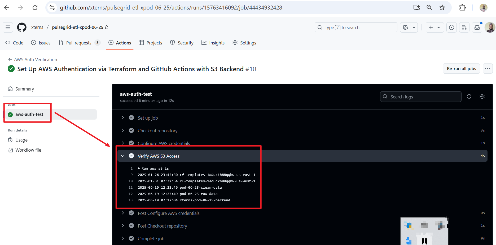

# Project: Configure AWS Authentication with GitHub Actions using Terraform

## Goal
Set up short-term static AWS credentials using Terraform, store them in GitHub Secrets, and configure GitHub Actions to authenticate with AWS and verify access to S3 using aws s3 ls.

### Folder Structure

```
## Folder Structure
 terraform/
 └── auth-setup/
     ├── main.tf
     ├── backend.tf
     ├── providers.tf
     ├── variables.tf
     ├── terraform.tfvars
     ├── outputs.tf
     └── modules/
         └── aws_iam_user/
             ├── main.tf
             ├── variables.tf
             └── outputs.tf
 .github/
 └── workflows/
     ├── pipeline.yml        Existing workflow
     └── aws-auth.yml        My new workflow
```

### Step 1: Configure Terraform S3 Backend 

**Purpose:** Use an existing S3 bucket to securely store the Terraform state file.

**What I did:**
- Integrated a remote S3 backend.
- Ensured the bucket exists and has appropriate permissions.
- This enables remote state management and collaboration.

### `backend.tf`

```
terraform {
  backend "s3" {
    bucket         = "xterns-pod-06-25-backend"
    key            = "auth-setup/terraform.tfstate"
    region         = "eu-north-1"
    encrypt        = true
  }

  required_providers {
    github = {
      source  = "integrations/github"
      version = "~> 5.0"
    }
    aws = {
      source  = "hashicorp/aws"
      version = "~> 5.0"
    }
  }
}
```
### Step 2: Root `main.tf` - Call the module

**Purpose:** Call the IAM module to create IAM resources and push credentials to GitHub secrets.

```
module "github_iam_user" {
  source        = "./modules/aws_iam_user"
  iam_user_name = var.iam_user_name
  policy_arn    = var.policy_arn
}

resource "github_actions_secret" "aws_access_key_id" {
  repository      = var.github_repo
  secret_name     = "AWS_ACCESS_KEY_ID"
  plaintext_value = module.github_iam_user.access_key_id
}

resource "github_actions_secret" "aws_secret_access_key" {
  repository      = var.github_repo
  secret_name     = "AWS_SECRET_ACCESS_KEY"
  plaintext_value = module.github_iam_user.secret_access_key
}
```

### Step 2b: Root `providers.tf` - Providers

**Purpose:** Define AWS and GitHub providers in a separate file for clarity.

```
provider "aws" {
  region = "eu-north-1"  # Match region with S3 backend
}

provider "github" {
  token = var.github_token
  owner = var.github_owner
}
```

### Step 3: Root `variables.tf` - Input vars

```
variable "iam_user_name" {
  description = "The name of the IAM user to create for GitHub Actions"
  type        = string
}

variable "policy_arn" {
  description = "ARN of the IAM policy to attach to the user"
  type        = string
  default     = "arn:aws:iam::aws:policy/AmazonS3FullAccess"
}

variable "github_token" {
  description = "GitHub personal access token"
  type        = string
  sensitive   = true
}

variable "github_owner" {
  description = "GitHub username or organization"
  type        = string
}

variable "github_repo" {
  description = "GitHub repository name"
  type        = string
}
```

### Step 4: Root `terraform.tfvars` - Values

```
iam_user_name = "github-actions-user"
github_owner  = "github-username"
github_repo   = "repo-name"

# github_token is passed via environment variable or GitHub Actions secret: TF_VAR_github_token
```

### Step 5: Root `outputs.tf` - Output values

```
output "access_key_id" {
  value = module.github_iam_user.access_key_id
}

output "secret_access_key" {
  value     = module.github_iam_user.secret_access_key
  sensitive = true
}
```

### Step 6: Module `main.tf` - IAM Logic in Module

```
resource "aws_iam_user" "github_action_user" {
  name = var.iam_user_name
}

resource "aws_iam_access_key" "github_action_user_key" {
  user = aws_iam_user.github_action_user.name
}

resource "aws_iam_user_policy_attachment" "attach_policy" {
  user       = aws_iam_user.github_action_user.name
  policy_arn = var.policy_arn
}
```

### Step 7: Module `variables.tf` - Parameterization

```
variable "iam_user_name" {
  description = "IAM username to create"
  type        = string
}

variable "policy_arn" {
  description = "Policy ARN to attach to IAM user"
  type        = string
  default     = "arn:aws:iam::aws:policy/AmazonS3ReadOnlyAccess"
}
```

### Step 8: Module `outputs.tf` - Key Output Values

```
output "access_key_id" {
  value = aws_iam_access_key.github_action_user_key.id
}

output "secret_access_key" {
  value     = aws_iam_access_key.github_action_user_key.secret
  sensitive = true
}
```

### Step 8b: Set GitHub Token Environment Variable

**Purpose:** Ensure Terraform can access your GitHub personal access token securely during local development or CI runs.

**What I did:**
- Exported the GitHub token as an environment variable `TF_VAR_github_token`
- This prevents Terraform from prompting for the token on `terraform plan` or `terraform apply`
- Helps automate the process and secures sensitive information outside of Terraform files

Command to run in your terminal before running Terraform commands:

```
export TF_VAR_github_token="your_actual_github_personal_access_token
```


### Step 8c: Run Terraform Plan

**Purpose:** Validate your Terraform configuration and preview changes without making any modifications to your infrastructure.

**What I did:**
- Ran `terraform plan` to ensure the configuration is syntactically correct and to see what resources will be created or modified.
- Confirmed that Terraform can read variables and connect to providers correctly.

**Command:**

```
terraform plan
```


### Step 8d: Run Terraform Apply

**Purpose:** Apply the Terraform configuration and create/update resources defined in my code.

**What I did:**

- Ran `terraform apply` to provision AWS IAM user, access keys, and push secrets to GitHub.
- Confirmed resources were created successfully by reviewing Terraform output.
- Verified that GitHub secrets were updated with the generated AWS credentials.

**Command:**

```
terraform apply
```


#### Verified that the secrets `AWS_ACCESS_KEY_ID` and `AWS_SECRET_ACCESS_KEY` appeared in GitHub repository secrets.


#### Captured snapshot of IAM user in AWS Console


### Step 9: Add `TF_VAR_github_token` to CI

**Purpose:** Ensure GitHub provider can authenticate to set secrets during apply.

**What I did:**

- Went to GitHub repository settings.
- Navigated to Secrets and Variables > Actions.
- Added a new repository secret:
- Name: TF_VAR_github_token
- Value: <`GitHub PAT`>

### Step 10: GitHub Actions Workflow

**Purpose:** Automatically test AWS authentication by running `aws s3 ls` from GitHub Actions using secrets provisioned by Terraform.

**What I did:**

- Created `.github/workflows/aws-auth.yml` alongside existing `pipeline.yml`
- Integrated AWS authentication logic using GitHub secrets.
- Ensured workflow is triggered on `push` to `main` and can also be run manually.

### `.github/workflows/aws-auth.yml`

```
name: AWS Auth Verification

on:
  push:
    branches:
      - main
      - '**'   # Trigger on all branches
  pull_request:
    branches:
      - '**'
  workflow_dispatch:

jobs:
  aws-auth-test:
    runs-on: ubuntu-latest

    steps:
      - name: Checkout repository
        uses: actions/checkout@v3

      - name: Configure AWS credentials
        uses: aws-actions/configure-aws-credentials@v4
        with:
          aws-access-key-id: ${{ secrets.AWS_ACCESS_KEY_ID }}
          aws-secret-access-key: ${{ secrets.AWS_SECRET_ACCESS_KEY }}
          aws-region: eu-north-1

      - name: Verify AWS S3 Access
        run: aws s3 ls
```

### How to Test `CI/CD` on a Feature Branch

If your main branch requires pull request approvals:

- Push your feature branch (e.g., `xpod-06-25-setup-aws-auth-with-secrets-and-verify-s3-access`)
- Open a Pull Request into `main`
- Ask a reviewer to approve and merge the PR
- Once merged, GitHub Actions will automatically trigger the `aws-auth.yml` pipeline
- You can also manually test from GitHub UI via "Run Workflow" under the `Actions` tab

  

## Conclusion

This project successfully demonstrates how to securely authenticate GitHub Actions with AWS using static credentials managed through Terraform. By automating the creation of an IAM user, securely storing credentials in GitHub Secrets, and validating access to AWS services (e.g., S3), we’ve established a strong foundation for CI/CD workflows in cloud-based data engineering environments.

#### Key takeaways include:

- Use of modular Terraform for reusable and scalable infrastructure code

- Integration of GitHub Actions with AWS for automated deployments

- Emphasis on security best practices through secret management and remote state

- Practical demonstration of Infrastructure as Code (IaC) in a healthcare analytics context

This setup is ideal for short-term authentication needs in projects where continuous integration with cloud services is essential.